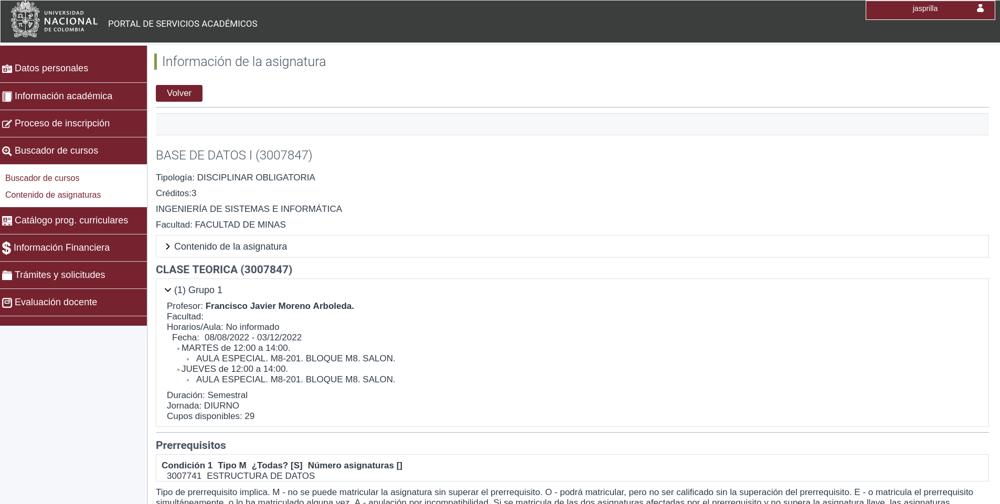

  

<h1 align="center">
    Como usar la herramienta
</h1>

Para usar la herramienta primero tendremos que dirigirnos a la pagina del curso que deseemos inscribir, estando en esta pagina basta con presionar las siguientes teclas:
- `Ctrl+A`
- `Ctrl+C`

> #### Pagina mencionada
> 
> Puedes buscar cursos mediante [este enlace](https://sia.unal.edu.co/ServiciosApp/facespublico/public/servicioPublico.jsf?taskflowId=task-flow-AC_CatalogoAsignaturas).

Ya teniendo esta informacion en nuestro portapapeles copiaremos la informacion en el input del aplicativo, para despues hacer click en el boton "Añadir curso".

¡Y listo! Has añadido tu primer curso, para añadir varios cursos simplemente repite el mismo proceso.